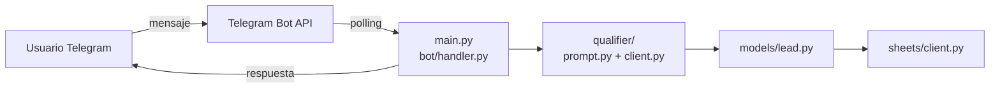
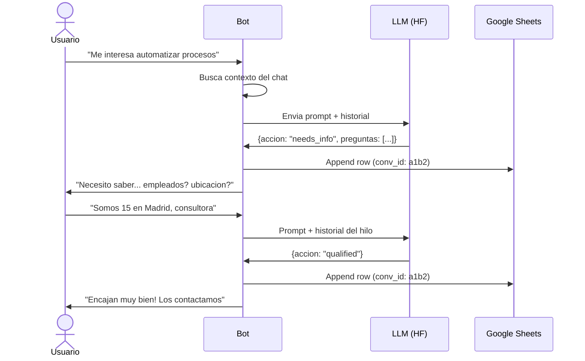
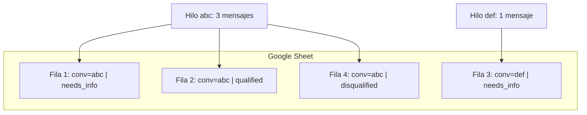
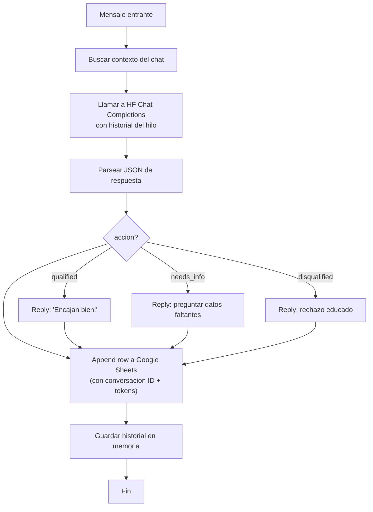

# Lead Qualification Bot

Bot de Telegram para cualificacion de leads usando LLMs de Hugging Face. Actua como una secretaria amable que evalua proyectos, registra resultados en Google Sheets y mantiene historial completo por hilo de conversacion.

Proyecto tecnico para **Orbyn** — empresa de automatizacion e IA.

## Arquitectura





## Stack Tecnologico

| Capa | Tecnologia |
|------|-----------|
| Bot | `python-telegram-bot` v21 (async, polling) |
| LLM | Hugging Face Chat Completions API (DeepSeek-V3.2) |
| Sheets | `gspread` + Google Service Account |
| Config | `python-dotenv` |
| Python | 3.11+ |

## Como Funciona

### Flujo de Evaluacion

1. El usuario envia datos del lead en texto libre
2. El bot evalua contra el ICP:
   - Empresa que **quiera automatizar** algo (cualquier rubro)
   - Minimo 5 empleados
   - Espana o Latinoamerica
   - Interes en automatizacion/IA
3. El bot determina una de tres acciones:
   - **qualified**: Responde cordial, se gestina el contacto
   - **needs_info**: Pide los datos faltantes de forma natural
   - **disqualified**: Rechazo educado, sin detalles
4. Cada mensaje se loguea como fila nueva en Google Sheets

### Historial por Conversacion

Cada hilo de conversacion tiene un **Conversacion ID** unico. Todas las filas con el mismo ID pertenecen al mismo hilo. Asi se puede filtrar en Sheets y ver la conversacion completa en orden cronologico.



### Flujo por Mensaje



### Ingenieria de Prompts

El prompt del sistema en `qualifier/prompt.py`:

- **Basado en rol**: El LLM actua como secretaria, no clasificador
- **Salida estructurada**: Fuerza JSON con `accion`, `razonamiento`, `campos_faltantes`, `preguntas`
- **Proteccion anti-injection**: Separacion estricta entre instrucciones sistema y datos usuario; reglas explicitas para ignorar instrucciones embedidas en el input
- **Preferir preguntar**: Ante la duda, pide mas info antes de descartar
- **No descartar por rubro**: Cualquier empresa puede automatizar algo

### Google Sheets

Cada mensaje se loguea como fila individual con:

| # | Columna | Contenido |
|---|---------|-----------|
| A | Fecha | Timestamp ISO del mensaje |
| B | Datos Recibidos | Texto crudo del usuario |
| C | Decision | Cualificado / Faltan datos / No cualificado |
| D | Motivo | Razonamiento interno del LLM |
| E | Campos Faltantes | Criterios que faltaban (si aplica) |
| F | Preguntas | Preguntas hechas al lead (si aplica) |
| G | Conversacion ID | Identificador unico del hilo |
| H | Tokens Input | Tokens de entrada consumidos |
| I | Tokens Output | Tokens de salida generados |
| J | Tokens Total | Formula =H+I (calcula automaticamente) |

Las filas se agregan en orden. Filtrando por **Conversacion ID** se ve el historial completo de cada hilo.

## Estructura del Proyecto

```
lead-qualifier/
  main.py               Punto de entrada — conecta bot, qualifier, sheets
  config.py             Configuracion desde env con validacion
  models/lead.py        Modelo LeadResult (accion, tokens, conv_id)
  qualifier/
    prompt.py           Prompt del sistema con proteccion anti-injection
    client.py           Cliente HF Chat Completions con reintentos
  bot/handler.py        Manejador de mensajes, contexto por chat
  sheets/client.py      Cliente Google Sheets (append + formula)
  .env.example          Variables de entorno requeridas
  requirements.txt      Dependencias Python
```

## Setup

```bash
git clone <repo-url> lead-qualifier
cd lead-qualifier

python3 -m venv venv
source venv/bin/activate
pip install -r requirements.txt

cp .env.example .env
# Completar con tus tokens en .env
```

Compartir la Google Sheet con el email del service account.

```bash
python main.py
```

## Consideraciones para Produccion

### 1. Defensa contra Prompt Injection
Separacion estricta instrucciones/datos + reglas explicitas en el prompt. En produccion: sanitizar input (control chars, patrones de injection), validar esquema JSON de salida, rate limiting por usuario.

### 2. Gestion de Costos de API
512 tokens max por llamada, temperatura 0.3. En produccion: cache de consultas repetidas, rate limiting por chat, monitoreo de tokens (column H-I en sheet), modelo de respaldo mas economico para filtrado inicial.

### 3. Resiliencia ante Errores
Reintentos con timeout de 30s, logging sin crashear. En produccion: circuit breaker para HF API, cola asincronica para sheet logging, modelo fallback para cuando el principal no responde.
